<a href="https://skillzaa.github.io/bilzaDocs/compCore/" >Core Props Examples</a> &nbsp;&nbsp;&nbsp;&nbsp; <a href="https://skillzaa.github.io/bilzaDocs/compProjects/" >Comp Projects</a>    
<!-- <a href="./samples.html" >Samples</a>&nbsp;     -->
---

# What is Bilza

---
> A Javascript Animation Engine for creating responsive animations on HTML5 Canvas.
---
Philosophy Behind Bilza.js

1. I think that in year 2022 creating complex animations in JavaScript should not be a black art. <b>Anybody who has basic JavaScript knowledge should be able to create animations.</b>

1. There are many content types (e.g. educational slides, business presentations etc.) which we want to be presented like a video but should be editable like normal text (or a PowerPoint presentation). In case of video format; editing is very expensive and time-consuming. On the other hand, editing a JavaScript animation is just editing a few commands.

1. In case you want your message / presentation to reach millions of viewers and the message is in videos format: the file size will be in Mega Bites (and this is on the lowest side). Imagine how many people will be reluctant to download such a heavy file or to share it. On the other hand, a JavaScript animation is very lightweight as compared to video format.  A JavaScript animation carrying the same message may have a file size of few kilo Bites. The heaviest thing in a JavaScript animation is the sound file. 

1. The single main "pain point" of creating JavaScript animation is <b> creating responsive animations</b>. We like to create animations, but we also want them to fit on to the many screen sizes. For this the bilza.js has been written with responsiveness in mind and (almost) every thing grow and shrink according to the screen size.

1. Animation is code and Code is Reusable : One of the basic purpose of this library is to enable users to stitch together small pieces of animation and create complex animations.

1. It is NOT morally and ethically correct for any developer / app to hold the data of its users as hostage. The hard work and effort that a user has put into creating an animation makes him the creator and owner of that animation. For this I will make sure that there is always some command present in the library (working on it currently) which should enable the user to get their animation data in json format so that they can use it else-where.  

# What Will Bilza.js Enable you to do ?

1. <i>Bilza.js will enable you to create JavaScript animation that behave like a video</i>. You can "play", "pause", "stop", "skip forward" and "skip backward" the animation just like a video. You can also  draw any random frame from in between the animation or save that as an image.

1. <i>Bilza.js will enable you to create slide (presentations, lesson plans, advertisements etc)</i> and then share them. The final product is a simple JavaScript file that will run in any (decent) browser anywhere. There is NO installation, NO plugins and NO dependencies (on any other library). This will enable your clients to consume your content with out any hassle.

1. <i>Bilza.js can help you in creating viral content</i>. To create viral content we need animation, but we want to make the file size as small as possible since downloading large content is what costs money to your customers. In this scenario light weight JavaScript animations seems like the best candidate.

---
# Basic Feature
- <strong>Ease of use</strong> 
- <strong>Responsiveness</strong> 
- <strong>Composable Animations</strong>  
- <strong>Behave like a Video</strong> 
---

---
<!-- The snippets from Docs -->
# Important Sections of Documentation

> <a href="https://skillzaa.github.io/bilzaDocs/docs/howBilzaWorks.html" target="_blank">How Bilza.js Works</a>

> <a href="https://skillzaa.github.io/bilzaDocs/samples/helloWorld.html" target="_blank">Hello world Example</a>

> <a href="https://skillzaa.github.io/bilzaDocs/compCore/" target="_blank">All Components Core Props Examples</a>

> <a href="https://skillzaa.github.io/bilzaDocs/compProjects/" target="_blank">Projects to showcase every component</a>

> <a href="https://skillzaa.github.io/bilzaDocs/index.html" target="_blank">Bilza.js Documentation (work in progress)</a>
---
<!-- The snippets from Docs -->
# Selected Examples

<a href="https://skillzaa.github.io/bilzaDocs/compProjects/circle/coloredCircles.html" target="_blank">Colored Circles
</a>

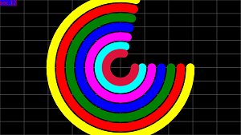

<a href="https://skillzaa.github.io/bilzaDocs/compProjects/fillRect/100comps.html" target="_blank">100 Rectangles
</a>

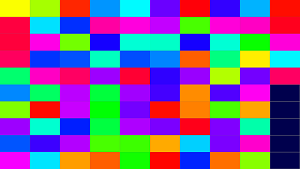

<a href="https://skillzaa.github.io/bilzaDocs/compProjects/line/100line.html" target="_blank">Lines Animation
</a>

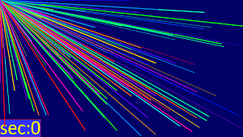

<a href="https://skillzaa.github.io/bilzaDocs/compProjects/text/100TextComps.html" target="_blank">Text and Grid Example
</a>

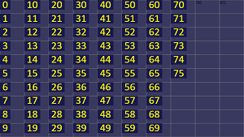

<a href="https://skillzaa.github.io/bilzaDocs/compProjects/line/randomLines.html" target="_blank">Random Lines
</a>

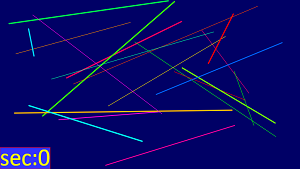

<a href="https://skillzaa.github.io/bilzaDocs/compProjects/pic/4pics.html" target="_blank">Four Pics
</a>

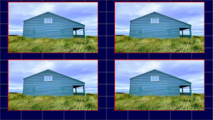

<a href="https://skillzaa.github.io/bilzaDocs/compProjects/grid/gridLinesWidth.html" target="_blank">Grid Lines Width
</a>

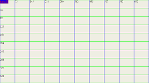

<a href="https://skillzaa.github.io/bilzaDocs/compProjects/circle/dancingCircles.html" target="_blank">Dancing Circles
</a>

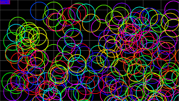

<a href="https://skillzaa.github.io/bilzaDocs/compProjects/circle/100comps.html" target="_blank">100 Circles
</a>

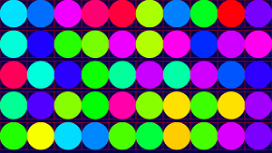

<a href="https://skillzaa.github.io/bilzaDocs/compProjects/circle/circleDemo.html" target="_blank">Circles Component Demo
</a>

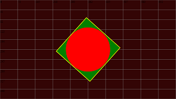

<a href="https://skillzaa.github.io/bilzaDocs/compProjects/grid/gridCellWidthAnimate.html" target="_blank">Animating Grid
</a>

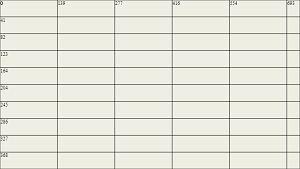

<a href="https://skillzaa.github.io/bilzaDocs/compProjects/text/fontSizeAnimate.html" target="_blank">Font Size Animation
</a>

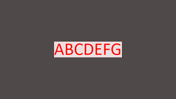

<a href="https://skillzaa.github.io/bilzaDocs/compProjects/line/lineAnimation.html" target="_blank">Line Animation
</a>

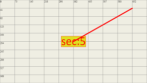

---
<small>If you want to be in touch or send me a bug report please use github issues.</small>

-----
###### <a href="https://skillzaa.github.io/bilzaDocs/releaseNotes/v0_1_1.html">17-sep-2022</a>   (version 0.1.1) // - Big Changes in API
###### 04-sep-2022   (version 0.1.0) // - Alhamdullah
###### 06-aug-2022   (version 0.0.30) //0 ver short of 0.1.0
###### 04-aug-2022   (version 0.0.29) //1 ver short of 0.1.0 
###### 26-july-2022   (version 0.0.28) //2 ver short of 0.1.0 
###### 25-july-2022   (version 0.0.27) //3 ver short of 0.1.0 
###### 23-july-2022   (version 0.0.26) //4 ver short of 0.1.0 
###### 22-july-2022   (version 0.0.25) 
###### 20-july-2022   (version 0.0.24) 
###### 13-july-2022   (version 0.0.23) 
###### 9-july-2022   (version 0.0.22) //Getting close to 0.1.0
###### 7-july-2022   (version 0.0.21) //also ver 0.0.20
###### 2-july-2022   (version 0.0.19) //release candidate for 0.1
###### 21-june-2022   (version 0.0.17) //also ver 0.0.18
###### 06-jun-2022   (version 0.0.16)
###### 03-jun-2022   (version 0.0.15)
###### 09-May-2022   (version 0.0.14)
###### 08-May-2022   (version 0.0.13)
###### 15-Apr-2022   (version 0.0.12)
###### 28-March-2022 (version 0.0.11)
###### 27-March-2022 (version 0.0.10)
###### 26-March-2022 (version 0.0.7)
###### 25-March-2022 (version 0.0.5)

