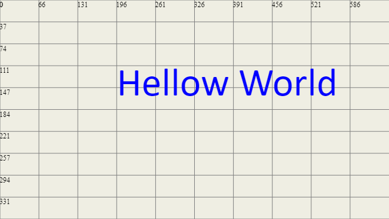

# What is Bilza

---
> Bilza is an easy to use Javascript framework/library for creating responsive animations and drawings (on HTML5 canvas) such that animations can be stitched together like lego pieces.
---
# Mission
- <strong>Easy of use</strong> : This library has no installations, built systems etc. Is usable with any project. Even primitive JavaScript knowledge is enough to start using it.(wait till I complete docs and tutorial videos).
- <strong>Responsiveness</strong> : The drawings and animations will resize its self according to the host screen size. (The most difficult part of this library).
- <strong>Composable Animations</strong> : The library will try to provide more and more tools to enable the creator to compose animations using smaller animation like LEGO pieces.(I know it sounds like a tall order, but I have plans :) ) 
---

# Docs and Samples 
<a href="https://skillzaa.github.io/bilzaDocs/">Bilza Sample</a>

---
## Important Points:-
+ Bilza has <strong>NO dependencies</strong> (up to this point). A lot of effort is made to keep the lib same, since linking to other libraries has all the security risks.
+  The entire library is also available in one single file thus you do not need any install and build system, just link the standalone version of bilza to your JavaScript file, and it should run without any problem on any browser.
+   Sound has been added on experimental basis such that it is not part of the library but externally attached with the start and stop buttons. This will definitely change in future, still linking sound externally works very well.
+   When ever we insert components into bilza engine, we have to tell the engine the starting frame (second) and the ending frame of that components. A component is just loaded and displayed between its starting frame and ending frame. <strong>When all components have completed their ending frame, the animation ends.</strong>
+ Before we create the bilza engine object, we need to feed it the ID of the HTML5 canvas element that we want it to target. That is how we can write separate scripts for any number of canvas elements on a page. If we do not specify an ID the library will create a canvas element and add it to the document. It is always better to already have canvas elements created in your HTML page, since then it is easy to style them using CSS.
+ We can create canvas as per a specific percentage of the screen width and height (<small> The default behaviour</small>) OR we can force the canvas to be of a specific width and height in pixels. If we create a fixed size canvas we can give it any size. <small>we can even create a canvas of the size of a button and put animation on to that</small>. However, sizing the canvas according to screen size <strong>is the default behaviour </strong> since most of the content are shared on smaller devices or devices of different screen width and height. 

+ Bilz.js has been written with responsiveness in mind. When you create an animation, you would like to run it on every screen size. This is one of the main tenants of this library, that <strong>all the drawings shrink and expand according to the screen size</strong>. It means that a "Text" component with "width" set to 80 will cover 80% of the screen on a small phone or a large extra wide monitor.

+ Though being responsive is the default behaviour of the bilza library, still you can opt out of it. You can decide to size the canvas as per fixed pixels, and you can also disable components responsiveness. For this purpose, you will also see similar naming components specifically made for responsive and non-responsive uses. For example, "Text" component is specifically designed for responsiveness whereas "RawText" component is used when the user want to have full control and manage things himself. Similarly, the "Grid" component draw grid based on percentage whereas "StaticGrid" draw grid based on pixels.
+ When we insert a component into bilza engine, we have following options:
    - "alwaysOn" : This will make the component visible throughout the duration of the animation. However, inserting components with alwaysOn does not affect the duration of the animation, we need other components to give the animation some duration to run. 
    - "add" : When we "add" a component, we have to provide the starting time (also called the starting frame) and the duration. The component will appear just between its starting and ending frame. If the ending frame is larger than the current duration of the animation will extend its self to accommodate the newly inserted component. Keep in mind that we can create blank frames while inserting components and the engine will not object to that, assuming you actually mean to create blank frames. For example, if we insert componentOne from frame 0 to 60 and componentTwo from frame 120 to 300. The animation duration has been set to 300 seconds, but there is no component displayed between frame 60 and 120. This is not an error, but may occur without knowing.
    - "append" : This comes in handy when we want to use premade scenes and just append them together (stitch them together like LEGO pieces).

+ The library is not "interactive" yet (i.e. does not respond to mouse clicks etc.) but this capability is on the cards soon.

+ The library currently has 10-15 components (Text,RawText,Grid,StaticGrid, Rectangle, FillRectangle, Circle / Arc, Line , FrameCounter, Row (experimental), Picture, Icon etc).

+ A component is what bilza library consumes. The only objective of bilza library is to draw components on the screen. That means that bilza library is extended through components. More and more components will be added every week or so. The utility of the library will only become visible once there are a reasonable number of components to use.

+ Almost every component is Child of BaseComponent and thus comes with build in <strong>"Properties"</strong> (called Props) like paddings, border, rotate, backgroundColor, color etc. etc. These props have methods for adding animations to these components.

+ To create animations we attach animations to the <strong>Properties (props)</strong> of a component giving it different values including the start frame of the animation and then end frame of the animation. The said animation will be performed between the given frames. For example <strong> comp.x.animate(0,10,0,100); </strong> will move the comp in x direction between frame 0 and 10 animating the value of x from 0 to 100.  
---
## Installation

> npm install bilza

---
## Getting Started

<pre>
<code>
import Bilza, { Ui,CompFactory as cf,hsl,TextTempl } from "./bilza.js";
//--Create Bilza engine
let bil = new Bilza("bilza", 70);
//--Create and add grid to engine
const grid = cf.grid("grey");
bil.insert.alwaysOn(grid);
//--create text, edit props, add animation and finally add text to engine
const txt = cf.rawText("Hellow World",hsl(240));
txt.x.set(30);
txt.y.set(30);
txt.width.oscillate(0,120,20,100,.15);
bil.insert.add(txt,0,120);
//--required for UI
const ui = new Ui(bil);
bil.draw(); 
</code>
</pre>

<small>If you want to be in touch or send me a bug report please use github issues.</small>

-----
###### 26-july-2022   (version 0.0.28) //2 ver short of 0.1.0 
###### 25-july-2022   (version 0.0.27) //3 ver short of 0.1.0 
###### 23-july-2022   (version 0.0.26) //4 ver short of 0.1.0 
###### 22-july-2022   (version 0.0.25) 
###### 20-july-2022   (version 0.0.24) 
###### 13-july-2022   (version 0.0.23) 
###### 9-july-2022   (version 0.0.22) //Getting close to 0.1.0
###### 7-july-2022   (version 0.0.21) //also ver 0.0.20
###### 2-july-2022   (version 0.0.19) //release candidate for 0.1
###### 21-june-2022   (version 0.0.17) //also ver 0.0.18
###### 06-jun-2022   (version 0.0.16)
###### 03-jun-2022   (version 0.0.15)
###### 09-May-2022   (version 0.0.14)
###### 08-May-2022   (version 0.0.13)
###### 15-Apr-2022   (version 0.0.12)
###### 28-March-2022 (version 0.0.11)
###### 27-March-2022 (version 0.0.10)
###### 26-March-2022 (version 0.0.7)
###### 25-March-2022 (version 0.0.5)

